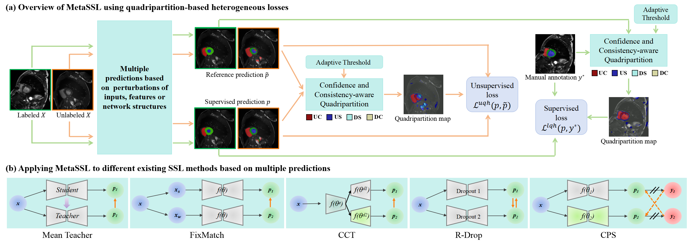

# [TMI 2025] MetaSSL: A General Heterogeneous Loss for Semi-Supervised Medical Image Segmentation
## 📌 Overall Framework


The overall MetaSSL framework is summarized as follows:
- MetaSSL is a versatile semi-supervised medical image segmentation method driven by a spatially heterogeneous loss function. This loss function categorizes the reference prediction into four groups, each assigned different weights. These weights are determined by the confidence level and the consistency between the reference and supervised predictions, allowing the model to focus on more valuable regions for effective learning from unannotated images.
- The spatially heterogeneous loss function is extended to labeled images in the semi-supervised learning process. This extension enables the model to identify challenging regions for learning while suppressing the impact of potential noisy annotations, thereby enhancing segmentation performance.
- A self-adaptive thresholding strategy is introduced to differentiate confident predictions from uncertain ones. This strategy adapts dynamically across different target classes and training stages, enabling more effective uncertainty-aware semi-supervised learning.

## 👀 Usage
We provide `code`, `data_split` and `models` (Include pre-trained models and fully trained models) for LA and ACDC dataset.


### To train a 2D model
```
python ./code/train_MetaSSL_2D.py  
``` 

### To train a 3D model
```
python ./code/train_MetaSSL_3D.py 
``` 

### To test a model
```
python ./code/test_2D.py  #for ACDC testing
python ./code_3D/test_3D.py  #for LA testing
```


## 📁 Dataset Download
Data could be got at:
- [LA](https://github.com/yulequan/UA-MT/tree/master/data)
- [ACDC](https://github.com/HiLab-git/SSL4MIS/tree/master/data/ACDC)


### Environment Setup

We recommend using Python 3.8+ with PyTorch 2.3.1 and MONAI 1.3+.


